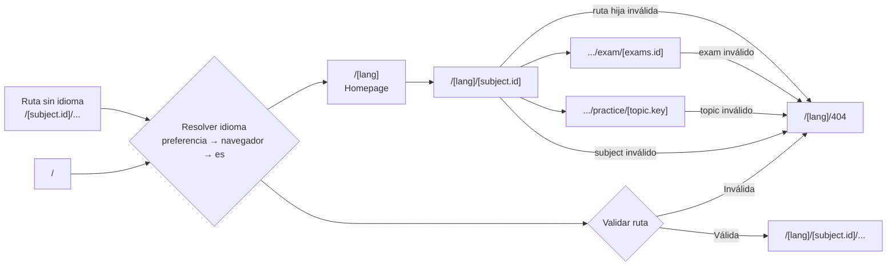

# Pásame Exámenes Context

"Pásame Exámenes" (título no traducible) es una web/app para practicar/estudiar preguntas de exámenes y recopilatorios de asignaturas de los grados impartidos en la "Facultade de Informática da Coruña (FIC)".

> La aplicación se encuentra en un rewrite de la mayoría de su código interno, el Styling de la web esta correcto y es el que se quiere mantener. Pero la app comenzó siendo escrita como una app muy basica con Vite + React Router, esta implementación se ha quedado corta para la app es por lo que se ha decidido comenzar con la migración a TanStack Start. Antes de comenzar la migración se hizo un cambio de React Router por TanStack Router, el cambio fue hecho rapidamente y no es final. El objetivo final con este rewrite es crear una codebase más limpia y mas mantenible. Que no dependa tango de scripts si no más del framework. La carpeta `/scripts` contiene muchos scripts desactualizados que seran poco a poco eliminados.
>
> Un ejemplo de los objetivos que pretende la migración es mejorar el SEO usando las herramientas que TanStack proporciona en vez de `generate-static-seo-pages.ts`, `generate-subject-pages.ts` o `generate-sitemap.ts`. Sin ser esto una lista exhasutiva.
>
> En la carpeta `/reference` puede encontra una copia de los archivos de antes de la migración de los que extraer la mayoría del código, ya que se quiere mantener todo el aspecto que el usuario veía se puede usar la mayoría del código anterior sin grandes modificaciones

La UI de la aplicación consta de tres idiomas: español (por defecto), galego e inglés.

La aplicación permite practicar por topic o por examen/recopilatorio. Las asignaturas se recopilan en `/src/subjects`, **todas las asignaturas de la web se conocen en build time**, no cambian durante la ejecución de la web. En `Datos de asignaturas` se define la relación entre elementos y en `/src/data/types.ts`. (En algunos casos se guardan los PDFs originales en `/public`)

## Visibilidad especial de asignaturas

- Las asignaturas públicas aparecen en la homepage y pueden formar parte del sitemap.
- `_template` es una asignatura de pruebas. Solo aparece en la homepage y se puede navegar a ella durante el desarrollo o en previews de Vercel. No forma parte del contenido indexable.
- `espain` es una asignatura secreta. No aparece en listados públicos ni en el sitemap, pero se puede abrir mediante su URL directa o siguiendo la secuencia de clicks de SecretToro.

## Rutas

La Homepage y las páginas de cada asignatura deben ser prerrenderizadas por motivos de SEO (`Static Prerendering`).

## Datos de asignaturas

Las preguntas son escritas, en su mayoría, en markdown que se renderiza en la web.

Existen diferentes tipos de preguntas en constante cambio; se añaden nuevos tipos de pregunta constantemente.

Esta lista crece constantemente y deberían llevarse registros de ejemplo de cada tipo de pregunta que ayuden a los agentes de IA que convierten los escaneos OCR de los materiales originales al formato Typescript que usa la app.

## SEO / GEO

Esta web/app es descubierta principalmente desde enlaces compartidos por redes sociales (importancia a las imágenes OG) y la búsqueda orgánica.

Debido a esto, las páginas del sitemap son solo la home page y las home page de las páginas de cada asignatura. Estas páginas también deben ser prerrenderizadas para que los indexadores puedan leer el contenido.

Por lo tanto, también son muy importantes las imágenes OG y los metatags. Existen metatags para cada idioma y para diferentes paths. Además, se generan imágenes OG personalizadas para cada asignatura con `scripts/generate-og-images.ts`

Las guías relevantes a seguir son:

https://raw.githubusercontent.com/tanstack/router/main/docs/start/framework/react/guide/seo.md
https://raw.githubusercontent.com/tanstack/router/main/docs/start/framework/react/guide/geo.md

# Branding / Diseño

Esta web trata de mantener un branding claro y consistente. En el archivo `style.css` se encuentra la mayoría del estilo de la web. El trabajo de diseño es un esfuerzo constante y la creación de un lenguaje homogéneo cambia constantemente.
