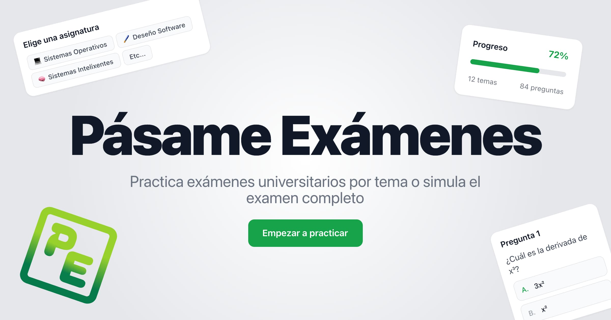

[](https://pe.pablopl.dev)

# <a href="https://pe.pablopl.dev"></a> Pásame Exámenes

<div align="center">

[](https://react.dev)
[](https://www.typescriptlang.org/)
[](https://vite.dev)
[](https://tailwindcss.com/)
[](https://vercel.com)
[](https://github.com/TeenBiscuits/Pasame-Examenes/pulls)
[](./LICENSE.md)
[](https://github.com/TeenBiscuits/Pasame-Examenes)

</div>

<div align="center">
<br/>
<b>Pásame Exámenes</b> es una plataforma open source para practicar exámenes universitarios por tema o simular el examen completo con temporizador y autocorrección.
<br/>
</div>

<div align="center">
<h3><a  href="https://pe.pablopl.dev">👉 pe.pablopl.dev 🌐</a></h3>
</div>

## Cómo funciona

Cada asignatura es una carpeta autónoma dentro de `src/subjects/`. Solo necesitas crear la carpeta con dos archivos (`meta.ts` y `questions.ts`) y la asignatura aparece automáticamente en la web. No hay backend: todos los datos son archivos TypeScript y el progreso se guarda en `localStorage`.

### Modo Práctica

Elige un tema y practica pregunta a pregunta. Cada pregunta se corrige individualmente, con explicaciones detalladas y posibilidad de auto-evaluarte en las preguntas abiertas. Tu progreso por tema se guarda automáticamente.

### Modo Examen

Simula el examen real: temporizador en cuenta atrás, puntuación en directo, y auto-entrega opcional. Al terminar, revisas todas las respuestas y ves si apruebas o suspendes.

### Tipos de pregunta

- **Opción múltiple** — 5 opciones, corrección automática
- **Texto / Cálculo** — Respuesta libre, auto-evaluación contra la solución modelo
- **Emparejamiento** — Relaciona conceptos con letras, corrección automática

## Asignaturas

| Asignatura                          | Universidad            | Exámenes      |
| ----------------------------------- | ---------------------- | ------------- |
| 💻 Sistemas Operativos              | Universidade da Coruña | 9 (2020–2024) |
| 🧠 Sistemas Intelixentes            | Universidade da Coruña | 5 (2023-2026) |
| 🤖 Introduction to Machine Learning | Linnaeus University    | 2 (2024–2025) |

## Tecnologías

<div align="center">

[](https://react.dev)
[](https://www.typescriptlang.org/)
[](https://vite.dev)
[](https://tailwindcss.com/)
[](https://reactrouter.com)
[](https://pnpm.io)

</div>

## Desarrollo

```bash
pnpm dev       # Servidor de desarrollo con HMR
pnpm build     # Type-check + build de producción
pnpm lint      # ESLint
pnpm preview   # Preview del build de producción
pnpm format    # Prettier
```

## Contribuye ✨

¡Toda contribución es bienvenida! Puedes:

- Añadir **nuevas asignaturas** con sus exámenes
- Corregir **errores** en preguntas existentes
- Reportar **issues** directamente desde cualquier pregunta
- Mejorar la **web** (features, diseño, accesibilidad)

> [!IMPORTANT]  
> Lee la [guía de contribución](./CONTRIBUTING.md) para empezar.

## Licencia

El código de la plataforma se distribuye bajo la licencia **Apache 2.0**. Consulta [LICENSE.md](./LICENSE.md) para más detalles.

Las preguntas y soluciones son contribuciones de la comunidad, pueden cometer errores de los que no nos hacemos responsables, nuestro objetivo es correguir todos los errores posibles, si ves un error [reportalo](https://github.com/TeenBiscuits/Pasame-Examenes/issues/new?template=report-question.yml).

Consulta cada asignatura para más información.

```js
// Made with love by Pablo Portas López
```
