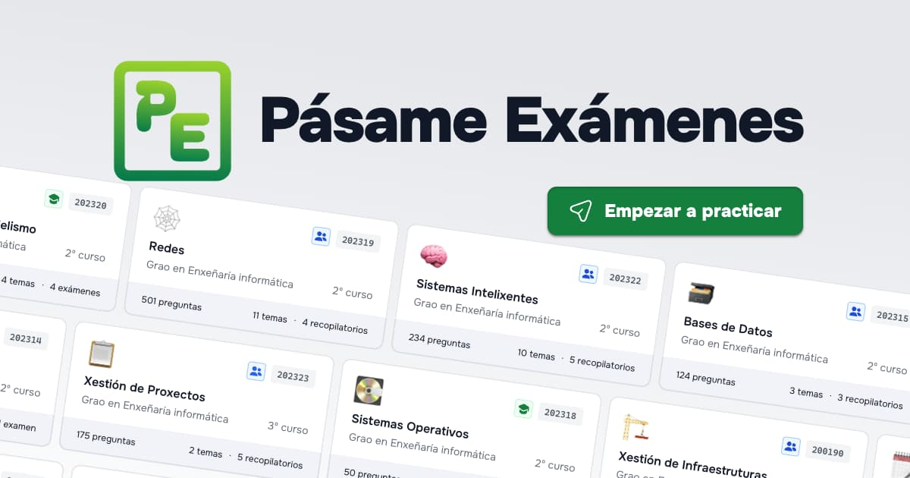

[](https://pe.pablopl.dev/?utm_source=github-readme&utm_medium=social&utm_campaign=public-launch)

# <a href="https://pe.pablopl.dev/?utm_source=github-readme&utm_medium=social&utm_campaign=public-launch"></a> Pásame Exámenes

<div align="center">

[](https://react.dev)
[](https://www.typescriptlang.org/)
[](https://vite.dev)
[](https://tailwindcss.com/)
[](https://reactrouter.com)
[](https://pnpm.io)
[](https://github.com/TeenBiscuits/Pasame-Examenes)
[](https://driverjs.com)
[](https://haptics.lochie.me)
[](https://vercel.com)
[](https://www.greptile.com/?utm_source=oss_badge&utm_medium=readme&utm_campaign=greptile_for_open_source)
[](https://github.com/TeenBiscuits/Pasame-Examenes/pulls)
[](./LICENSE.md)
[](https://github.com/TeenBiscuits/Pasame-Examenes)

</div>

<div align="center">
<br/>
<b>Pásame Exámenes</b> es una plataforma de código abierto para practicar exámenes de la FIC por tema o en modo cronometrado, con respuestas modelo y autocorrección.
<br/>
</div>

<div align="center">
<h3><a  href="https://pe.pablopl.dev/?utm_source=github-readme&utm_medium=social&utm_campaign=public-launch">👉 pe.pablopl.dev 🌐</a></h3>
</div>

## Cómo funciona

Cada asignatura es una carpeta autónoma dentro de `src/subjects/`. Solo necesitas crear la carpeta con dos archivos (`meta.ts` y `questions.ts`) y la asignatura aparece automáticamente en la web. No hay backend: todos los datos son archivos TypeScript y el progreso se guarda en `localStorage`.

### Modo Práctica

Elige un tema y practica pregunta a pregunta. Cada pregunta se corrige individualmente, con explicaciones detalladas y posibilidad de auto-evaluarte en las preguntas abiertas. Tu progreso por tema se guarda automáticamente.

### Modo cronometrado

Practica con temporizador, puntuación en directo y auto-entrega opcional. En asignaturas con exámenes autorizados puede reflejar el formato real; en el resto usa recopilatorios o ejercicios originales con estructura orientativa.

### Tipos de pregunta

- **Opción múltiple** — 5 opciones, corrección automática
- **Texto / Cálculo** — Respuesta libre, auto-evaluación contra la solución modelo
- **Emparejamiento** — Relaciona conceptos con letras, corrección automática

## Asignaturas

<!-- SUBJECTS_TABLE:START -->

| Asignatura                          | Grao                          | Curso |  Exámenes/etc |
| ----------------------------------- | ----------------------------- | ----: | ------------: |
| 🗃️ Bases de Datos                   | Grao en Enxeñaría informática |    2º | 3 (2022–2026) |
| ⚡ Concorrencia e Paralelismo       | Grao en Enxeñaría informática |    2º | 4 (2024–2025) |
| 🎨 Deseño de Software               | Grao en Enxeñaría informática |    2º | 2 (2020–2022) |
| 💻 Estrutura de Computadores        | Grao en Enxeñaría informática |    2º |      1 (2026) |
| 🗓️ Proceso Software                 | Grao en Enxeñaría informática |    2º |      1 (2026) |
| 🕸️ Redes                            | Grao en Enxeñaría informática |    2º | 4 (2008–2026) |
| 🧠 Sistemas Intelixentes            | Grao en Enxeñaría informática |    2º | 5 (2023–2026) |
| 💽 Sistemas Operativos              | Grao en Enxeñaría informática |    2º | 4 (2023–2024) |
| 🌐 Internet y Sistemas Distribuidos | Grao en Enxeñaría informática |    3º |             1 |
| 🔗 Programación Integrativa         | Grao en Enxeñaría informática |    3º |             1 |
| 🏗️ Xestión de Infraestruturas       | Grao en Enxeñaría informática |    3º |      4 (2024) |
| 📋 Xestión de Proxectos             | Grao en Enxeñaría informática |    3º | 5 (2024–2026) |

<!-- SUBJECTS_TABLE:END -->

## Desarrollo

```bash
pnpm dev       # Servidor Vite con HMR; carga react-grab solo en desarrollo
pnpm build     # tsc -b + sitemap + IndexNow + OG images + build producción + páginas estáticas
pnpm lint      # ESLint flat config para TS/TSX; ignora scripts/
pnpm readme    # Actualiza la tabla de asignaturas del README
pnpm format    # Prettier --write
pnpm preview   # Preview del build de producción
pnpm doctor    # React Doctor
```

No hay script `test` ni `typecheck` separado: `pnpm build` es la verificación de tipos.

### i18n y temas

La plataforma es trilingüe (español, inglés, gallego) con un sistema de i18n propio en `src/i18n/`. Incluye 4 temas visuales (claro, oscuro, rosa, Catppuccin) conmutables desde la interfaz, aplicados mediante `data-theme` en `<html>`.

### Generación de OG images

El build genera automáticamente imágenes Open Graph por asignatura y página principal usando `@napi-rs/canvas`, que los crawlers usan para previsualizaciones en redes sociales.

## Contribuye ✨

¡Toda contribución es bienvenida! Puedes:

- Añadir **nuevas asignaturas** con exámenes autorizados, pruebas, recopilatorios o ejercicios originales
- Corregir **errores** en preguntas existentes
- Reportar **issues** directamente desde cualquier pregunta
- Mejorar la **web** (features, diseño, accesibilidad)

> [!IMPORTANT]  
> Lee la [guía de contribución](./CONTRIBUTING.md) para empezar.

> [!CAUTION]
> No se aceptan enunciados, PDFs o materiales docentes protegidos sin autorización para compartirlos.

## Licencia

El código de la plataforma se distribuye bajo la licencia **Apache 2.0**. Consulta [LICENSE.md](./LICENSE.md) para el texto completo.

El contenido subido a la web, incluyendo preguntas y soluciones, se considera licenciado bajo **CC BY-SA 4.0** salvo que se indique otra licencia específica en la página de la asignatura correspondiente. Consulta [LICENSE-CONTENT.md](./LICENSE-CONTENT.md) para el texto completo.

<p>El contenido de <a href="https://pe.pablopl.dev">Pásame Exámenes</a> © 2026 por <a href="https://pablopl.dev">Pablo Portas López</a> está licenciado bajo <a href="https://creativecommons.org/licenses/BY-SA/4.0/">CC BY-SA 4.0</a></p>

```text
Copyright 2026 Pablo Portas López

   Licensed under the Apache License, Version 2.0 (the "License");
   you may not use this file except in compliance with the License.
   You may obtain a copy of the License at

       http://www.apache.org/licenses/LICENSE-2.0

   Unless required by applicable law or agreed to in writing, software
   distributed under the License is distributed on an "AS IS" BASIS,
   WITHOUT WARRANTIES OR CONDITIONS OF ANY KIND, either express or implied.
   See the License for the specific language governing permissions and
   limitations under the License.
```

Las preguntas y soluciones son contribuciones de la comunidad, pueden cometer errores de los que no nos hacemos responsables, nuestro objetivo es corregir todos los errores posibles, si ves un error [repórtalo](https://github.com/TeenBiscuits/Pasame-Examenes/issues/new?template=report-question.yml).

```js
// Made with love by Pablo Portas López
```
