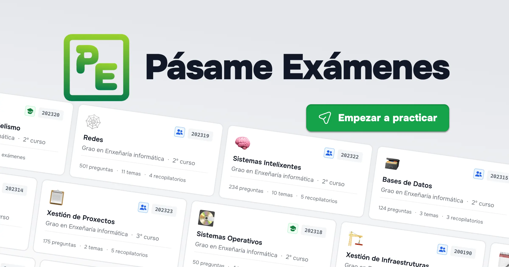

[](https://pe.pablopl.dev/?utm_source=github-readme&utm_medium=social&utm_campaign=public-launch)

# <a href="https://pe.pablopl.dev/?utm_source=github-readme&utm_medium=social&utm_campaign=public-launch"></a> Pásame Exámenes

<div align="center">

[](https://react.dev)
[](https://www.typescriptlang.org/)
[](https://vite.dev)
[](https://tailwindcss.com/)
[](https://tanstack.com/start/latest)
[](https://biomejs.dev/)
[](https://pnpm.io)
<br />
[](#arquitectura)
[](https://driverjs.com)
[](https://vercel.com)
[](https://www.greptile.com/?utm_source=oss_badge&utm_medium=readme&utm_campaign=greptile_for_open_source)
[](CODE_OF_CONDUCT.md)
[](https://github.com/TeenBiscuits/Pasame-Examenes/pulls)
[](./LICENSE.md)
[](https://github.com/TeenBiscuits/Pasame-Examenes)

</div>

<div align="center">
    <br/>
    <b>Pásame Exámenes</b> es una plataforma para practicar preguntas de exámenes y recopilatorios de las asignaturas de la Facultade de Informática da Coruña (FIC).
    <br/>
</div>

<div align="center">
<h3><a  href="https://pe.pablopl.dev/?utm_source=github-readme&utm_medium=social&utm_campaign=public-launch">👉 pe.pablopl.dev 🌐</a></h3>
</div>

La aplicación permite:

- practicar por tema o por examen;
- revisar respuestas, puntuación y progreso;
- estudiar en español, galego o inglés;
- consultar preguntas con Markdown, fórmulas y contenido multimedia.

## Arquitectura

La aplicación usa React, TanStack Start, TanStack Router, Vite y TypeScript.

Home y las páginas públicas de asignatura generan su HTML durante el build para que los buscadores puedan leer su contenido. Las rutas de práctica y examen se cargan de forma interactiva en el navegador.

## Desarrollo local

### Requisitos

- Node.js
- pnpm

### Instalar y arrancar

```bash
pnpm install
pnpm dev
```

La aplicación queda disponible en [http://localhost:3000](http://localhost:3000).

`pnpm dev` genera antes las estadísticas de contenido y las imágenes OG necesarias para la aplicación.

## Comandos

| Comando           | Uso                                                                                 |
| ----------------- | ----------------------------------------------------------------------------------- |
| `pnpm dev`        | Arranca el servidor de desarrollo.                                                  |
| `pnpm build`      | Genera los assets, crea el build de producción y prerenderiza las páginas públicas. |
| `pnpm preview`    | Sirve localmente el build de producción.                                            |
| `pnpm check`      | Ejecuta las comprobaciones de Biome.                                                |
| `pnpm typecheck`  | Comprueba los tipos de TypeScript.                                                  |
| `pnpm lint`       | Ejecuta el linter de Biome.                                                         |
| `pnpm format`     | Comprueba el formato de los archivos.                                               |
| `pnpm run doctor` | Ejecuta React Doctor sin sustituir a Biome.                                         |
| `pnpm readme`     | Actualiza la tabla de asignaturas de este README.                                   |

## Contenido

Las asignaturas viven en `src/subjects`. Cada una tiene un `meta.ts` con sus temas y exámenes y un `questions.ts` con las preguntas. Las preguntas usan objetos TypeScript y pueden incluir Markdown, fórmulas y referencias a imágenes en la carpeta `assets` de la asignatura.

Para añadir una asignatura:

1. Crea `src/subjects/<id>/meta.ts`.
2. Crea `src/subjects/<id>/questions.ts`.
3. Añade las imágenes en `src/subjects/<id>/assets` si las necesita.
4. Ejecuta `pnpm typecheck` y `pnpm build`.

La lista siguiente se genera con `pnpm readme`. No edites sus filas a mano.

<!-- SUBJECTS_TABLE:START -->

| Asignatura                          | Grado                         | Curso |        Exámenes |
| ----------------------------------- | ----------------------------- | ----: | --------------: |
| 🧮 Cálculo                          | Grao en Enxeñaría informática |    1º | 8 (2022 a 2025) |
| 🗃️ Bases de Datos                   | Grao en Enxeñaría informática |    2º | 3 (2022 a 2026) |
| ⚡ Concorrencia e Paralelismo       | Grao en Enxeñaría informática |    2º | 4 (2024 a 2025) |
| 🎨 Deseño de Software               | Grao en Enxeñaría informática |    2º | 2 (2020 a 2022) |
| 💻 Estrutura de Computadores        | Grao en Enxeñaría informática |    2º |        1 (2026) |
| 🗓️ Proceso Software                 | Grao en Enxeñaría informática |    2º |        1 (2026) |
| 🕸️ Redes                            | Grao en Enxeñaría informática |    2º | 4 (2008 a 2026) |
| 🧠 Sistemas Intelixentes            | Grao en Enxeñaría informática |    2º | 5 (2023 a 2026) |
| 💽 Sistemas Operativos              | Grao en Enxeñaría informática |    2º | 4 (2023 a 2024) |
| 🌐 Internet y Sistemas Distribuidos | Grao en Enxeñaría informática |    3º |               1 |
| 🔗 Programación Integrativa         | Grao en Enxeñaría informática |    3º |               1 |
| 🏗️ Xestión de Infraestruturas       | Grao en Enxeñaría informática |    3º |        4 (2024) |
| 📋 Xestión de Proxectos             | Grao en Enxeñaría informática |    3º | 5 (2024 a 2026) |

<!-- SUBJECTS_TABLE:END -->

> [!CAUTION]
> No se aceptan enunciados, PDFs o materiales docentes protegidos sin autorización para compartirlos.

## Estructura principal

```text
src/
├── components/   Componentes compartidos de la interfaz
├── i18n/         Traducciones y selección de idioma
├── lib/          Lógica común
├── routes/       Rutas de TanStack Router
├── subjects/     Metadatos, temas, exámenes y preguntas
└── styles.css    Estilos globales
public/           Assets públicos e imágenes OG
scripts/          Generadores de build y herramientas auxiliares
```

## Licencia

El código de la plataforma se distribuye bajo la licencia **Apache 2.0**. Consulta [LICENSE.md](./LICENSE.md) para el texto completo.

El contenido subido a la web, incluyendo preguntas y soluciones, se considera licenciado bajo **CC BY-SA 4.0** salvo que se indique otra licencia específica en la página de la asignatura correspondiente. Consulta [LICENSE-CONTENT.md](./LICENSE-CONTENT.md) para el texto completo.

```ts
// Made with love by Pablo Portas López
```
